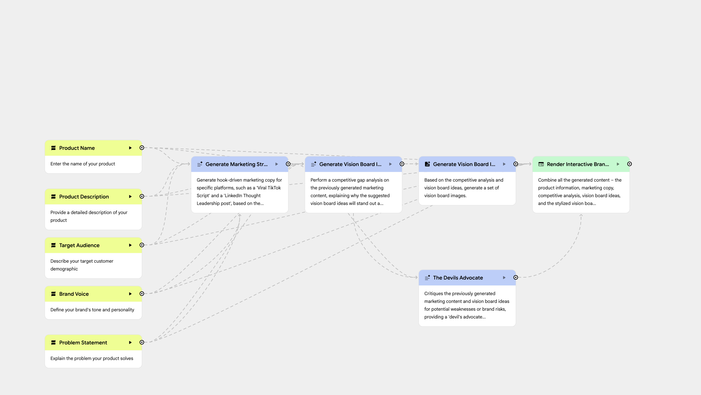

# 🚀 Marketing Maven Remix: AI Agent Design

This repository contains the architecture and logic for a high-impact marketing agent built with **Google Opal**. By using this setup, you can turn Gemini into a multi-step automation engine that generates strategies, visuals, and interactive brand decks in one click.

---

## 🛠️ How to Build Your "Super Gem"

Follow these steps to deploy this workflow using the **Gemini Gem Manager** and **Opal**.

### 1. Access the Gem Manager
1. Go to [gemini.google.com/gems](https://gemini.google.com/gems/view).
2. Look for the **"My Gems from Labs"** section.
3. Click **+ New Gem**. (If this is your first time, follow the prompts to sign in to the **Opal** experiment).

### 2. The "Super Prompt" (Automated Setup)
Instead of building every node manually, use Opal's **Natural Language Editor** (the chat box at the bottom) to generate the entire structure instantly. Paste this into the prompt box:

> **The Remix Prompt:**
> "Build a 'Marketing Maven Remix' agent. Create 4 User Inputs: Product Name, Target Audience, Brand Voice, and The Problem. Chain these into 3 parallel Generate nodes: 1) Platform-specific hooks for TikTok/LinkedIn, 2) A Competitive Gap Analysis, and 3) Vision Board Images with cinematic 35mm styling. Add a final 'Devil’s Advocate' node to critique the strategy for risks before outputting to an Interactive Webpage with auto-layout."

### 3. Fine-Tuning in the Visual Editor
Once Opal builds the map, click the **Editor** button at the top to polish the logic:
* **The "Wow" Node:** Select the **Image Generation** node. In the sidebar, ensure the style prompt is set to: *"Cinematic lighting, 35mm film grain, editorial style for Vogue."*
* **The Expert Review:** Select the **Devil's Advocate** node. Set its prompt to: *"Critique the previous nodes for weaknesses. Act as a grounded strategist, not a 'yes-man'."*
* **Premium Reveal:** Select the **Output** node and set the type to **Webpage with auto-layout**.

---

## 🧠 Strategic Architecture

| Component | The "Maven" Improvement |
| :--- | :--- |
| **Input Nodes** | Expanded to include "The Problem" and "Brand Vibe" for better creative context. |
| **Logic Nodes** | Multidimensional strategy (Gap analysis + platform hooks) instead of simple lists. |
| **Expert Review** | **The Devil’s Advocate** ensures a thoughtful, professional deliverable. |
| **Output** | **Interactive Brand Deck** that is scrollable and visually formatted for clients. |

---

## 🧪 Testing the "ZenTea" Case
Switch to **App Mode** and click **Start** to run a test with this "creative fuel":
* **Product:** ZenTea (Sparkling Matcha)
* **Problem:** Mid-day energy crashes and coffee jitters.
* **Vibe:** Luxury / Minimalist.
* **Result:** A bulletproof marketing deck with editorial-grade visuals and a critical risk-assessment.

---

### 📚 References & Resources
* **Official Guide:** [Opal Quickstart Documentation](https://developers.google.com/opal/quickstart)
* **Build Mode:** [Gemini Gem Manager](https://gemini.google.com/gems/view)
